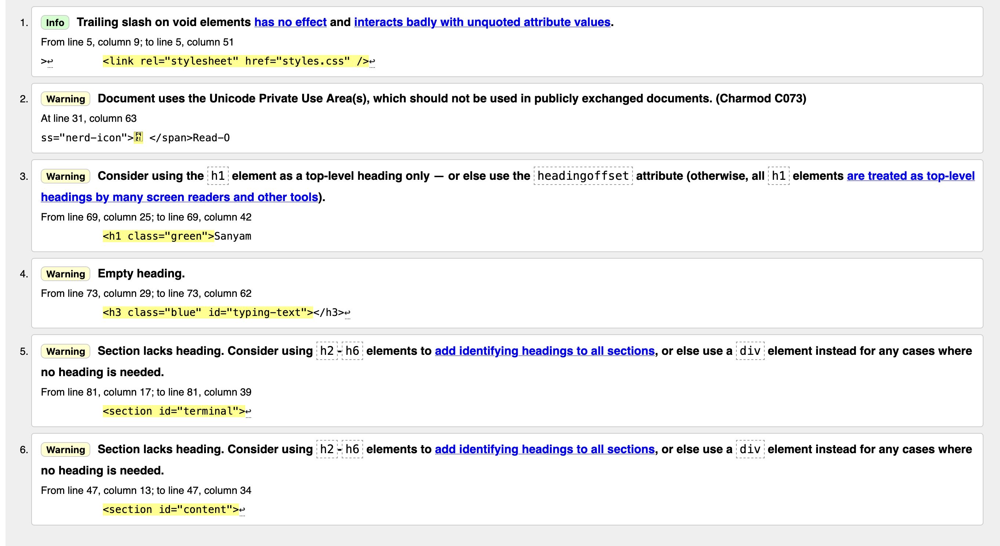
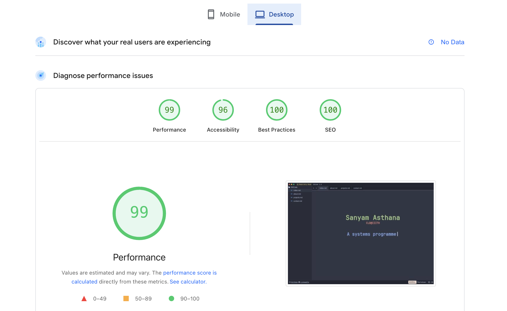
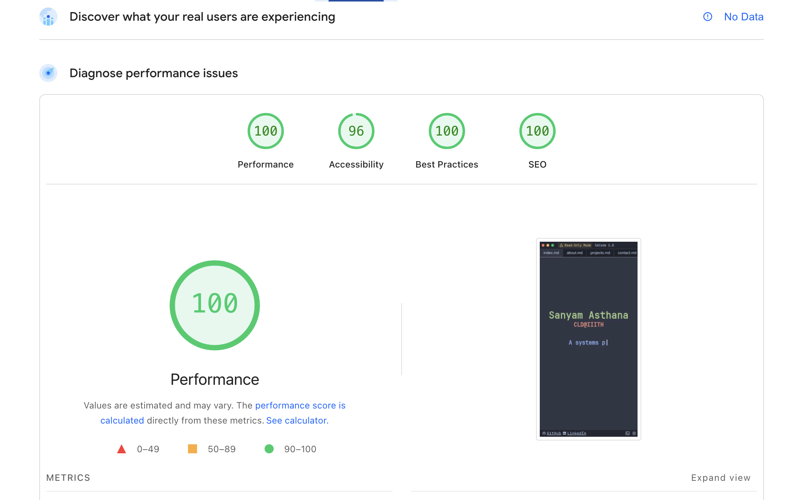
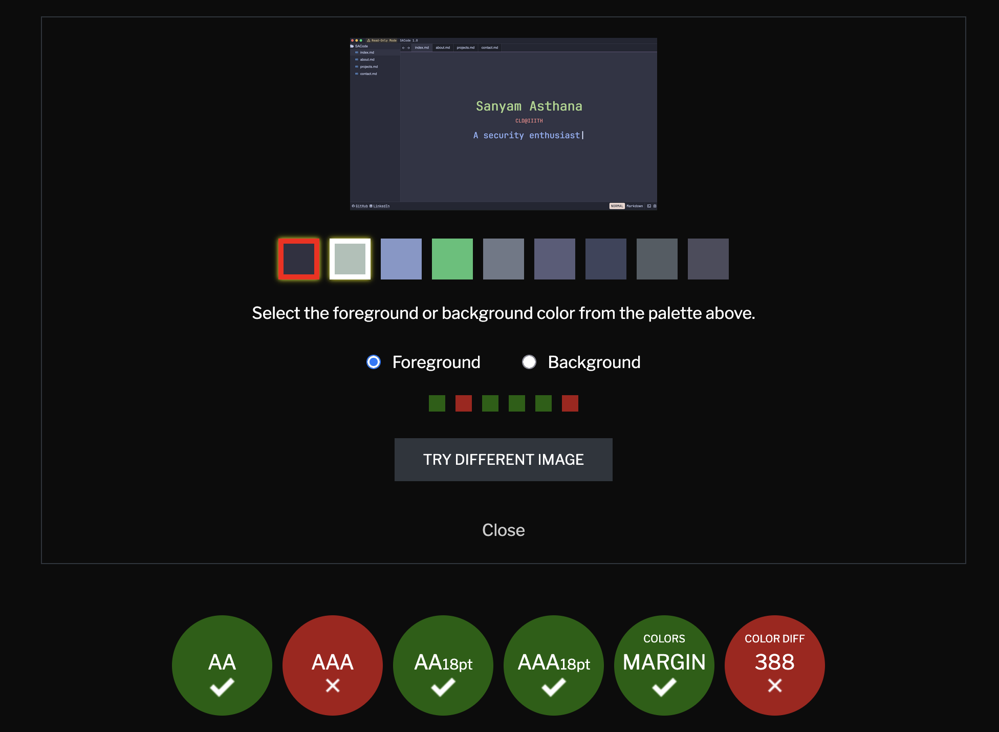
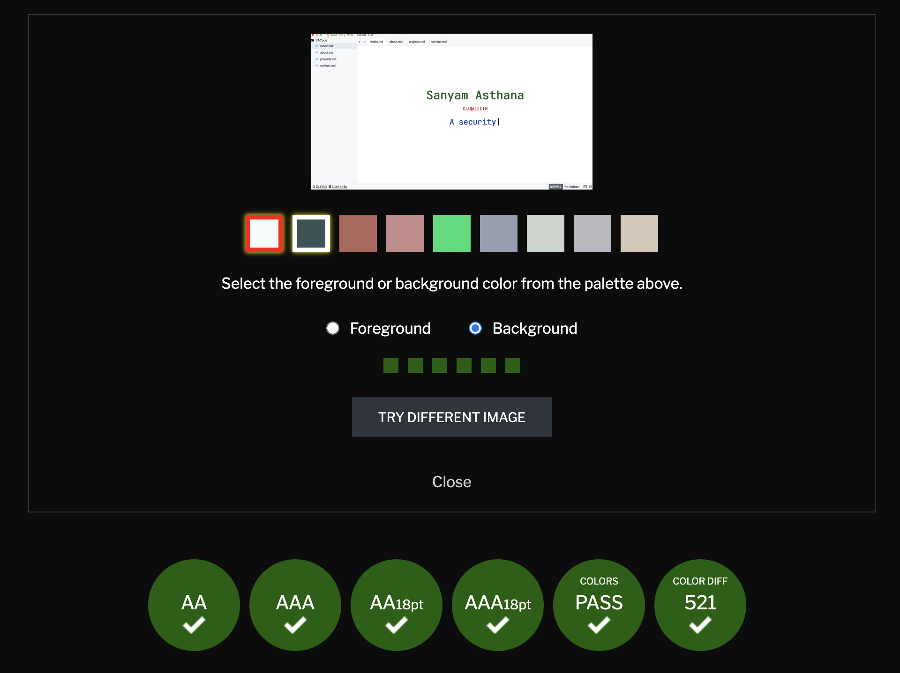

# Introduction

Following is a kind of website I have always wanted to make, but didn't really get the perfect time/opportunity to. I took this assignment as the opportunity to execute my ideas. The following is not a complete representation of my ideas, and still has a lot more to be done in.

The website is inspired by the code editor "Zed", which is a continuation by the developers of Atom, a text editor I always loved, before the tech giant played its games.

For accessibility and simplicity, I had to implement some "non-text" features in the "text" part of the editor, but I think they came out nice. A design faithful to Zed, but still accessible enough for the public.

# Details

**Name:** Sanyam Asthana

**Roll Number:** 2025114012

# JS Features

## Group A (Filterable Projects)

The projects are filterable using tags associated with them, using filters on top of the `projects.html` page. The technologies are stored in an array. The projects have classes associated with them, pertaining to the respective technologies. The naming has been done in a way, such that the class names, and the filter checkbox IDs can be fetched at once. The URL is changed using `searchParams`.

## Group B (Typed Text Component)

The typed text component is a reusable class, which uses simple `setTimeout`s for the typing animation. All the strings are provided as an attribute of the class' object, and then two loops, one for writing, and one for erasing, simulate the typing effect. The core function is a recursive function, to get along with the asynchronous nature of `setTimeout`. When one cycle finishes, it recursively calls the function for the next string in the array. When the index is greater than length of the array, the index is set to 0 to reset the sequence. 

# Typography

Since the theme of the website is of a code-editor, the UI font is kept as `Helvetica`, which is the default for my editor, and the "code" part of website is `JetBrains Mono`, which is my favorite programming font, specifically the Nerd Font variation of it, which gives me access to certain icons out of the box. I had to edit the font and remove the unnecessary glyphs so that the size of the font file could be reduced, so that it doesn't take long to download when to page loads.

# Animations used

## Hero staggered effect

The staggered fade-ins of the three elements of the Hero section chronologically reveal increasing amounts of information. The first is the name, then the course and the college, and third is the roles.

## Timeline slide effect

The timeline effect reveals the path of my life. The animation communicates the "graduality" of each milestone, and that whatever has been done, hasn't been done instantly, and is instead, a result of continued perseverance. The "jagged" layout of the timeline, rather than a straight one reflects that the path of life is indeed a jagged one, and is never a straight highway.

The hover effect to reveal more information + the depth effect on hover reflect the curiosity of the reader in knowing the depth of each milestone.

## Project Card hover effect

The hover effect on the project cards communicate the same "depth" the timeline cards communicate. When the user hovers on a project card, the card expands to show the "depth" of the project and the card is pushed "deep" into the page.

# Required Screenshots

## W3C Validation

## Lighthouse Audit Report

### Desktop

### Mobile

## WCAG Validation

### Dark theme (catpuccin)

### Light theme (github-light)

# Live Deployment

**URL:** https://researchweb.iiit.ac.in/~sanyam.asthana/